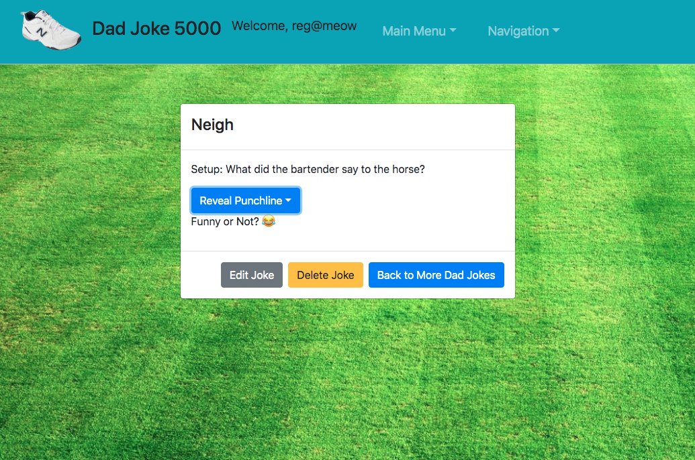

# Dad Joke 5000 - Front End

# Role of App

The Earth is populated by 7B people, many of whom are lacking in one of life's most basic needs: humor. Fortunately, there's Dad Joke 5000. Who needs books when there's a modern joke database for all of your knee slappin' one-liners? Grab a random joke from the icanhazdadjoke 3rd party API, or sign up to create, read, update, delete, and vote on jokes that are laugh out loud life of the party hits or eyerolling 'don't quit your day job' flops.

- Built using React with JavaScript
- Heavy reliance on Bootstrap for Component visualization
- Uses both Authenticated and Unauthenticated routing
- Integrates with Express API backend
- Uses 3rd party API for random SHOW

# Frontend Links

- Repo: https://github.com/DaveOrDavid/dj5k
- Deployed Site: https://daveordavid.github.io/dj5k/

# Backend Links

- Repo: https://github.com/DaveOrDavid/dj5k-backend
- Heroku Deployed: https://thawing-beyond-32492.herokuapp.com/

# Planning Process

I had known I was going to make this app for a while, but I wanted to utilize Bootstrap for more visual pop and ease of creation.

The main concern was 1) not spoiling the joke, so a modal with a dropdown for the punchline was use. (2) Using a 3rd party API as a test to myself and for Unauthenticated usage.

I wanted to use React to see how Component / State usage would be vs. POJO

# Installation and Instructions for Use

Installation:
- Download this template.
- Unzip and rename the template directory.
- Move into the new project and git init.
- Empty README.md and fill with your own content.
- Replace react-auth-template in package.json with your projects name.
- Replace the "homepage" field in package.json with your (public) Github account name and repository name.
- Install dependencies with npm install.
- git add and git commit your changes.
- Run the development server with npm start.

- You can either Sign Up to get an account to create your jokes. No one else will see these jokes except for you.  You'll have access to Tell a Joke and create one, Edit it, or Delete it.  You can also vote if you like your joke or not.
- If you do not wish to Sign Up, you can use the 3rd party icanhazdadjoke API and select a random joke to view.

# Future Development Plans

- Find a way to refresh the third party API so users can get a new Dad Joke again and again
- Optimize for mobile
- Further optimization on CSS
- Change All jokes to a non-Authenticated route for all to see.
- Create a "private" and "public" button to make certain jokes private
- Maybe tagging use (i.e. "office humor", "knock knock")

# User Stories

- As a user, I would like to sign up
- As a user, I would like to sign in
- As a user, I would like to change password
- As a user, I would like to sign out
- As a signed in user, I would like to create a joke
- As a signed in user, I would like to view my jokes
- As a signed in user, I would like to update my jokes
- As a signed in user, I would like to delete my jokes

# Images

Wireframe

Screenshot

